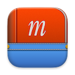

# Milonchik

Lightweight English-Hebrew dictionary for macOS.

## Features

- Fast, light and made for macOS.
- Type a word in English and get a Hebrew translation, and vice versa.
- For many words, includes inflections, synonyms and examples.

## Usage

### Keyboard Shortcuts

- While the search field is focused:
  - In the definitions list, press <kbd>↑</kbd> to select the definition above.
  - In the definitions list, press <kbd>↓</kbd> to select the definition below.
